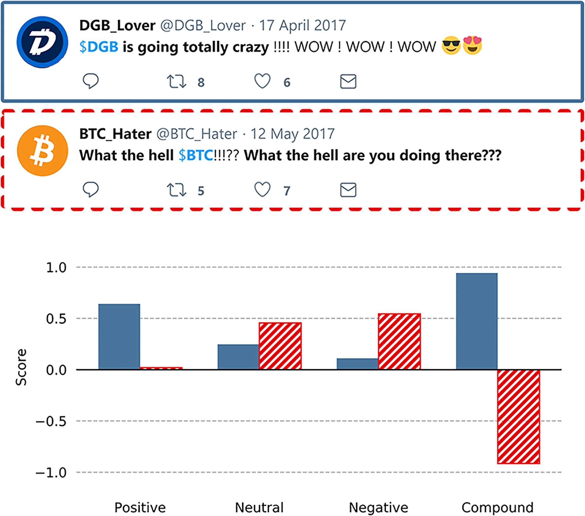

```{r setup, include=FALSE}
knitr::opts_chunk$set(echo = TRUE, message = FALSE,
                      warning = FALSE)
library(readr)
library(janitor)
library(lubridate)
library(ggplot2)
library(dplyr)
library(kknn)
library(rsample)
library(tidyverse)
library(tidymodels)
```

## Introduction  
  
  The purpose of this project is to generate a model that will predict 
  the return rate is positive or negative for ETH based on the activity 
  of Twitter.          
  
### Background
As Cryptocurreny popularized, it came as a big roar in social media. 
Cryptocurrency is A cryptocurrency is a digital or virtual currency that is
secured by cryptography, which makes it nearly impossible to counterfeit or 
double-spend. More about the definition can be read on this website.  
  
https://www.investopedia.eom/terms/c/cryptocurrency.asp  
  
Once Cryptocurrencies hit the market, it created an uproar amongst the crowd. 
Many researchers claim that the fluctuation of emotions regarding 
cryptocurrencies by the public plays a significant part in the price 
fluctuations of the cryptocurrencies. The data was collected using the social 
media platform Twitter, and 181 altcoins were used combined in 426520 tweets 
over a period of 71 days. By using sentiment analysis, the VADER scores were 
collected and used in the dataset. To closely examine whether the prices of 
cryptocurrencies are really affected by sentiments of social media and 
cryptocurrency enthusiasts that display vivid emotion online, this dataset will 
be used to examine the relationship between the rate fluctuation and VADER 
score, as well as other factors that may show significant change in the price 
of the cryptocurrency.    
  
  
#### What is Cryptocurrency?  
Cryptocurrency is a digital currency designed to work as a medium of exchange 
through a computer network that is not reliant on any central authority, such 
as a government or bank, to uphold or maintain it. It is a decentralized 
system for verifying that the parties to a transaction have the money they 
claim to have, eliminating the need for traditional intermediaries, such as 
banks, when funds are being transferred between two entities.  

https://en.wikipedia.org/wiki/Cryptocurrency  
  
  
#### What is altcoin? 
Every alternative to Bitcoin as an altcoin here.  
  
  
#### what is Ethereum(ETH)?  
Ethereum is a decentralized, open-source blockchain with smart contract 
functionality. Ether is the native cryptocurrency of the platform. Among 
cryptocurrencies, ether is second only to Bitcoin in market capitalization. In
other words, Ethereum is the biggest altcoin according to its market 
capitalization. 

https://en.wikipedia.org/wiki/Ethereum  
    
#### VADER score  
In order to extract the sentiment expressed in a tweet, we applied VADER, 
a valence-based sentiment analysis model that especially addresses the analysis 
of social media text such as tweets. When applying VADER for sentiment analysis,
four different scores are computed: positive, neutral, negative and compound. 
The positive, neutral and negative scores are portions or segments of text that 
are matched to their respective group. These segments, when added to each other,
should total a sum of $1$. The compound score represents the sum of each’s word 
valence in the lexicon. This sum is then normalized to a score between 
$-1$ (extremely negative) and $+1$ (extremely positive). Fig 2 visualizes 
the scores that were calculated using VADER on two artificially generated 
example tweets. The tweet marked in blue contains several positive expressions 
such as “WOW” and happy emoticons. Consequently, the tweet has a high positive 
score and a highly positive compound score. The tweet highlighted in red dots 
expresses the opposite by using the negatively connoted expression “What the 
hell are you doing????”. This leads to a high negative score and a highly 
negative compound score. The above-mentioned scores were calculated for 
every single tweet. These tweets were grouped according to their timestamp by 
calculating the mean of each score. This allowed us to assign these scores to 
the referred altcoin and subsequently use them as features for the prediction 
models.  

{width="196"}
  
https://journals.plos.org/plosone/article?id=10.1371/journal.pone.0208119#pone.0208119.s001

  
#### Dataset  
* `Time`: (string) timestamp of query, unit is a calendar year. Both, 
rate(price) and social media activities were updated every $3$ hours.    
* `Cryptocurrency`: (string) altcoin name  
* `Rate`: (numeric) rate or price of certain altcoin, unit is one BTC  
* `Volume`: (numeric) trading Volume    
* `NumTweets`: (numeric) mean number of tweets, unit is Count(n)  
* `Coumpound`: (numeric) mean VADER Score
* `Negative`: (numeric) mean negative VADER Score 
* `Positive`: (numeric) mean positive VADER Score  
* `Neutral`: (numeric) mean neutral VADER Score   
  
### Loading and Exploring Raw Data    
* Reading the dataset from a csv file into data frame.  
```{r}
# loading data
crypto <- read_csv('compound.csv')
crypto <- select(crypto, columns = -1)
```

* These are the first $6$ rows of the dataset.   
```{r}
# First 6 rows of the dataset with all columns
head(crypto)
```

* The dataset has $94664$ observations and $9$ attributes in total
* Also we found there are $181$ unique altcoins.  
```{r}
# size of the dataset
dim(crypto)
length(unique(crypto$Cryptocurrency))
```

* There is no missing value inside this dataset.  
```{r}
# identify amount of missing value
sum(is.na(crypto))
```

* Summaries the interested variables `Rate`, `Volume`, `NumTweets`, `Positive`
`Negative`, `Compound`, `Neutral`. 
```{r}
# Variable summaries
summary(crypto %>% select(-Time, -Cryptocurrency,))
```

* Let's take a look the mean values of all those columns. All of them are very
small.  
```{r}
crypto[, 3:9] %>% colMeans()
```

## Data Cleaning 
* Clean names: make the first letter of all column names lower letter, also add
underscore between words in each column name.  
* Filt out the rows with name `ETH` in column `cryptocurrency`. This altcoin is
what we're interested and all analyses will be based on.
* Parse date and add new columns: `date`, `month`, `day`
* Sort all the rows from earliest time to latest time.
* And we have $523$ observations and $12$ columns after cleaning and mining now.
```{r}
# clean names
crypto <- crypto %>% clean_names()

# Filt out the rows with name `ETH` in column `cryptocurrency` 
crypto <- crypto %>% filter(cryptocurrency == "ETH")

# Parse date 
crypto <- crypto %>%
  mutate(
    # create date into lubridate format
    date = parse_date(gsub( " .*$", "", crypto$time), "%Y-%m-%d"),#parse_date(time, "%d/%m/%Y")
    month = month(date),
    day = day(date),
    #timelag = 
  )

# Sort by time, earliest -> latest
crypto <- crypto[order(crypto$time),]

head(crypto)
dim(crypto)
```
  
### Data Split  
Both, prices and social media activities were updated every three hours to also allow for short-term analysis. These datasets are not continuous but split into two time periods. The first period starts on March 21 and ends on May 5, 2017 and thus covers 45 days. The data collected in this range represented the training set. The second period covers 26 days and starts on May 9 and ends on June 4, 2017. The data obtained in this range functioned as the test set. This set was used to evaluate the models based on the training set. 

* Add a new column 'return', the computations are completed by 
$$return_1 = price_1 - price_0$$. 
This process has to be completed after data spliting. Since the time is 
continuous inside each dataset, but not between train dataset and test test. 
After the computation, I removed the $1st$ row of both datasets. Because of the
logic of computation, the value of `return` of the $1st$ row is $0$, which is 
not true and may affect our future analysing result. Therefore, I think it's a
better idea to remove it here.  
* Then I add new column `make_money`, this column is a factor and only contains
value either 'yes' or 'no'. And the values determined by whether the `return` is
positive. If it's positively, that means we make money! And this attribute is 
also our reponse variable, or what I'll predict all the time in the whole 
report.  
* Finally, I have $332$ samples for train dataset and $189$ samples for test
dataset.  
* Next, use *v*-fold cross-validation on the training set. Use 5 folds. 
Dataset is split into a 5 number of folds and is used to evaluate the model's
ability when given new data. K5 refers to the number of groups the data sample 
is split into. In other words we split the data points into 5 equally sized 
subsets in K-folds cross-validation, called "folds." One split subsets act as 
the testing set, and the remaining folds will train the model.  

```{r}
crypto_train <- crypto[which(crypto$date <= '2017-05-05'),] # data collected before '2017-05-05' were collecting for training, there are around 333 observations
crypto_test <- crypto[which(crypto$date >= '2017-05-09'),] # data collected before '2017-05-05' were collecting for testing, there are around 190 observations
#nrow(crypto)

#######claculate the return 
crypto_train$new <- c(tail(crypto_train$rate, -1), 0) # add the `rate` of next row to current row as the value of `new`, make the last value of `new` column 0. Use tail() for extracting all values except the 1st one, b/c it's invalid.
crypto_train$return <- c(0,head((crypto_train$new - crypto_train$rate), -1)) # get the `return` by find out the difference between `new` and `rate`, which also means (price_1 - price_2), and also set the first value of `return` is 0. Use head() to keep all values except the last one, b/c it's invalid value
crypto_train <- tail(crypto_train, -1) # remove the first row, because the return rate is 0 there

crypto_test$new <- c(tail(crypto_test$rate, -1), 0) # did same thing, but it's for the test dataset
crypto_test$return <- c(
  0,head((crypto_test$new - crypto_test$rate), -1)) # did the same thing, but it's for the test dataset
crypto_test <- tail(crypto_test, -1) # remove the first row, because the return rate is 0 there

########Determine whether make money based on whether the value of `return` is positive.
crypto_train$make_money <- crypto_train$return > 0
crypto_train$make_money <-replace(
  crypto_train$make_money, crypto_train$make_money=='TRUE', 'yes')
crypto_train$make_money <- replace(
  crypto_train$make_money, crypto_train$make_money=='FALSE', 'no')
crypto_train$make_money <- factor(crypto_train$make_money)

crypto_test$make_money <- crypto_test$return > 0
crypto_test$make_money <-replace(
  crypto_test$make_money, crypto_test$make_money=='TRUE', 'yes')
crypto_test$make_money <- replace(
  crypto_test$make_money, crypto_test$make_money=='FALSE', 'no')
crypto_test$make_money <- factor(crypto_test$make_money)

nrow(crypto_train)
nrow(crypto_test)
# use *v*-fold cross-validation on the training set. Use 5 folds.
crypto_fold <- vfold_cv(crypto_train, v = 5)
```


## EDA (Exploratory Data Analysis)   
  
The entire exploratory data analysis will be based on the training set, 
which has $332$ observations. Each observation represents a record of the data
of ETH, and activities on Twitter relates to ETH at the moment of every three 
hours gap. The activity was measured by the number of tweets that referred to a 
certain altcoin and the sentiment that they contained. 
  
### Distribution of VADER score variables  
Positive, negative, neutral VADER score should sum to $1$ for each observation. 
We could see from the boxplots below that most tweets have higher neutral VADER
score. Then, positive VADER score occupies a little higher portions than negative
VADER score relatively. We might think the moods of people on Twitter is medium
optimistic.   

```{r}
par(mfrow=c(2,1))
boxplot(crypto_train[,c("positive","negative","neutral")], horizontal = TRUE)
boxplot(crypto_train[,c("positive","negative")], horizontal = TRUE)
```


### Variables
Let's take a look how each attribute distributed. We coould see only compound
and positive VADER score are approximately normal distributed.  

```{r}
crypto_train %>%
  keep(is.numeric) %>%
  gather() %>%
  ggplot(aes(value)) +
  facet_wrap(~ key, scales = 'free') +
  geom_histogram()
```

Let's  also take a look the how variables distributed numerically.  
```{r}
summary(crypto_train)
```

And also check the mean values of each numerical variables.  
```{r}
crypto_train[, 3:9] %>% colMeans()
```

We could from the Month Distrubtion. That there are most records on Apr, 2017 for altcoins.  

### Correlation Matrix
Create a correlation matrix of the training set. We could find there is 
moderately negative correlation between `compound` and `negative`. And there is
highly positive correlation between `compound` and `positive`. This is not 
surprising according the way that caculate compound VADER score. However, we'll
still add interactions in the recepi later.  

```{r}
library(corrplot)

crypto_train_new <- crypto_train %>% select(volume, num_tweets, positive, negative, compound, neutral, return)

crypto_corr = cor(crypto_train_new) 

corrplot(crypto_corr, method = 'number') 
```

### Exploration of Response Variable
  We want to predict whether `make_money` at this moment, and this will be 
  determined by `return`. Let's break down further by `month`. We could see from
  the plot below that, most of the time that return is around $0$.
```{r}
graph <- crypto_train
graph$month <- as.factor(graph$month)
graph$month <- recode_factor(graph$month, '3' = 'March', '4' = 'April', '5' = 'May')
ggplot(graph, aes(x = return)) +
  geom_histogram(fill = "blue", colour = "black") +
  facet_grid(graph$month ~ .)
```
  
## Create Model  
Firstly, we'll create a recipe for all the models we're going to make in next
step. `make_money` would be the response variable, volume of trading, number of
tweets, VADER scores(positive, negative, neutral, compound) are the predictors.
Then we'll add interactions between `compound` and `negatie`, `compound` and
`positive`. Because they have correlations.  
```{r}
# Set up a recipe to predict `make_money` with `volume`, `num_tweets`, 
# `positive`, `negative`, `neutral`, `compound`
#update_role(everything(), new_role = "any role will do")
crypto_recipe <- recipe(make_money~volume+num_tweets+positive+negative+neutral+compound, 
  data = crypto_train) %>% 
  step_dummy(all_nominal_predictors()) %>% 
  step_normalize(all_predictors()) %>%
  step_interact(terms = ~negative:compound) %>%
  step_interact(terms = ~positive:compound)
```
  
### Logistic Regression
* This is a classification model.
* Set up a workflow of logistic regression.
* Fit the $5$ folds of train data.
* Save results of model fitting into "logi_tune.rda"
```{r}
# Specifying an Engine
logi_model <- logistic_reg(penalty = 0) %>% 
  set_engine("glm") %>% 
  set_mode("classification")

# Workflow
logi_wf <- workflow() %>%
  add_recipe(crypto_recipe) %>%
  add_model(logi_model) 

# Create grid
degree_grid <- grid_regular(degree(range = c(1, 5)), levels = 5)

# Fit model
logi_tune <- tune_grid(
  object = logi_wf, 
  resamples = crypto_fold, 
  grid = degree_grid
)

# Save data of model to a file. Then we don't need to run it again when knit. 
save(logi_tune, logi_wf, file = "logi_tune.rda")
```

  The best logistic regression model has a roc_auc around $0.5014652$.  
```{r}
show_best(logi_tune, metric = "roc_auc") %>% select(-.estimator, -.config)
```


### Random Forest
* This is a classification model.
* Set up a workflow of random forest.
* Fit the $5$ folds of train data.
* Save results of model fitting into "rf_tune.rda"
```{r}
rf_model <- 
  rand_forest(
              min_n = tune(),
              mtry = tune(),
              mode = "classification") %>% 
  set_engine("ranger")

rf_workflow <- workflow() %>% 
  add_model(rf_model) %>% 
  add_recipe(crypto_recipe)

rf_params <- parameters(rf_model) %>% 
  update(mtry = mtry(range= c(2, 6)))

# define grid
rf_grid <- grid_regular(rf_params, levels = 2)

rf_tune <- tune_grid(
  object = rf_workflow,
  resamples = crypto_fold, 
  grid = rf_grid)

save(rf_tune, rf_workflow, file = "rf_tune.rda")
```


```{r}
autoplot(rf_tune)
show_best(logi_tune, metric = "roc_auc") %>% select(-.estimator, -.config)
```
    
Taking a quick peak at the autoplot() function, it is clear that accuracy and 
roc_auc decreases as the number of randomly selected predictors increases. 
The smaller number of observations needed to keep splitting nodes
(minimal_node_size) has higher accuracy and roc_auc.  

```{r}
show_best(rf_tune, metric = "roc_auc") %>% select(-.estimator, -.config)
```
  
    
### Boosted Trees
* This is a classification model.
* Set up a workflow of boosted trees.
* Fit the $5$ folds of train data.
* Save results of model fitting into "bt_tune.rda"
```{r}
bt_model <- boost_tree(mode = "classification",
                       min_n = tune(),
                       mtry = tune(),
                       learn_rate = tune()) %>% 
  set_engine("xgboost")

bt_workflow <- workflow() %>% 
  add_model(bt_model) %>% 
  add_recipe(crypto_recipe)

bt_params <- parameters(bt_model) %>% 
  update(mtry = mtry(range= c(2, 6)),
         learn_rate = learn_rate(range = c(-5, 0.2))
  )

# define grid
bt_grid <- grid_regular(bt_params, levels = 2)

bt_tune <- bt_workflow %>% 
  tune_grid(
    resamples = crypto_fold, 
    grid = bt_grid
    )

save(bt_tune, bt_workflow, file = "bt_tune.rda")
```

```{r}
autoplot(bt_tune)
```
  Lower learn_rate, higher number of ramdoml selected predictors tends to have 
  higher accuracy and roc_auc.  
  
```{r}
show_best(bt_tune, metric = "roc_auc") %>% select(-.estimator, -.config)
```


### KNN(K-nearest neighbors)
* This is a classification model.
* Set up a workflow of KNN.
* Fit the $5$ folds of train data.
* Save results of model fitting into "knn_tune.rda"
```{r}
knn_model <- 
  nearest_neighbor(
    neighbors = tune(),
    mode = "classification") %>% 
  set_engine("kknn")

knn_workflow <- workflow() %>% 
  add_model(knn_model) %>% 
  add_recipe(crypto_recipe)

# set-up tuning grid ----
knn_params <- parameters(knn_model)


# define grid
knn_grid <- grid_regular(knn_params, levels = 2)

knn_tune <- tune_grid(
  object = knn_workflow, 
  resamples = crypto_fold, 
  grid = knn_grid)

save(knn_tune, knn_workflow, file = "knn_tune.rda")
```


```{r}
autoplot(knn_tune)
```
  
  Taking a quick peak at the autoplot() function, this shows that the idea 
  number of neighbors is 1. Let’s confirm this with the show_best() function.
```{r}
show_best(knn_tune, metric = "roc_auc") %>% select(-.estimator, -.config)
```
  
### Compare models
We load the saved results of each model first and choose the best one of each
of them. And then select to show the mean value of `roc_auc`. Higher value of
`roc_auc`, better model. We found that the KNN has the highest `roc_auc` value.
Therefore, we'll continue with KNN.  

```{r}
# load the results of each model
load("logi_tune.rda")
load("bt_tune.rda")
load("rf_tune.rda")
load("knn_tune.rda")

# choose the best one of each of them.
#logi <- (show_best(logi_tune, metric = "roc_auc") %>% select(-.estimator, -.config))[1,]
#rf <- (show_best(rf_tune, metric = "roc_auc") %>% select(-.estimator, -.config))[1,]
#bt <- (show_best(bt_tune, metric = "roc_auc") %>% select(-.estimator, -.config))[1,]
#knn <- (show_best(knn_tune, metric = "roc_auc") %>% select(-.estimator, -.config))[1,]
logi <- (show_best(logi_tune, metric = "roc_auc") %>% select(mean))[1,]
rf <- (show_best(rf_tune, metric = "roc_auc") %>% select(mean))[1,]
bt <- (show_best(bt_tune, metric = "roc_auc") %>% select(mean))[1,]
knn <- (show_best(knn_tune, metric = "roc_auc") %>% select(mean))[1,]

table <- c(logi, rf, bt, knn)
table
```

## Final Fitting
We fit the test data into the KNN model that we buil to before. And compare the
predicted value of `make_money` with the actual value of `make_money` in test
dataset. We achieve this by observing the value of `accuracy` of the model.    
```{r}
final_rf_workflow <- rf_workflow %>% 
  finalize_workflow(select_best(rf_tune, metric = "roc_auc"))

rf_final_model <- fit(final_rf_workflow, crypto_train)

model_test_predictions <- predict(
  rf_final_model, new_data = crypto_test, type='class') %>% 
  bind_cols(crypto_test %>% select(make_money))

model_test_predictions %>% accuracy(truth = make_money, estimate=.pred_class)
```

## Conclusion
KNN model performs best and Random Forest model performs worst. Not very
surprising, since Sparse Datasets (Zero Values). There are a lot zero values 
in the dataset. Which might be the rason make Random Forest fail.

The `roc_auc` of the KNN model is around $0.56$ when I run it most of the time. 
Sometimes, it's even really close to $0.6$. According to the value of `roc_auc`,
this is not a very good model but it's still valuable. Since the `roc_auc` 
is above $0.5$. And it's hard to achieve a high `roc_auc` score for financial
model in general. In addition, the accuracy is also above average.  

Some ways that I may improve for this model. Firstly, the samples for ETH is
not a lot. It might improve predicting if I could collect more relative datas 
in the future. Secondly, data were collected at a $3$ hours cycle due to the 
usage limitation of twitter api. But prices of cryptocurries are particularly 
volatile and it changes all the time. I could consier the way to collect data
with a shorte time gap next time. Also we're interested in whether social media
activities affect the price of cryptocurries this time. So we take account 
the sentiment of messages. However, time might be also a factor to influence 
the sentiments or characteristics of tweets. I'll take in account the time for
improving model next time. Probably categorize the different time range.